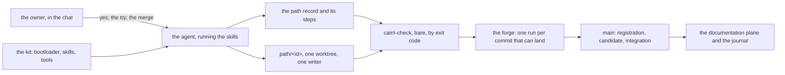

# Cairn 1.1 — a repository run by a sole owner with agents

**Promoted from** the owner's
[decisions page](../../feedbacks/2026-09-06-cairn-1-1-decisions.md) at blob
`110cde972d683680bdeb713264a26fd8f9f44acd` and the
[rulings note](../../feedbacks/2026-09-06-cairn-1-1-rulings.md) at blob
`313f8ea18fe77d0fb6f641ac969989dc4d35a17f`, through the fifteen
[decision records](../adr/index.md) ADR-001 to ADR-015. The notes stay
exactly as they were. This page states what the records decide as one
shape; where a sentence relies on a record, the record is named. Nothing
here is implemented yet: the [roadmap register](../../project/coding-paths/index.md)
names the coding paths that build it.

**Amended on 2026-09-07** by the promotion of the coding guidelines,
through the five records ADR-016 to ADR-020, from the owner's
[coding-guidelines decisions page](../../project/brainstorm/2026-09-07-coding-guidelines-decisions.md)
at blob `48112c310e1c127b0265ed63c8255bb0377264fa` and the four research
notes it gathers — [the coding stance](../../project/brainstorm/2026-09-07-coding-stance-research.md)
at blob `65987c7a2227b406c41198e6aa53460854ed24d8`,
[the step cycle](../../project/brainstorm/2026-09-07-step-cycle-research.md)
at blob `65e7a2a96a4046af05f67a4e06ff9328fe03068f`,
[the component slicing](../../project/brainstorm/2026-09-07-component-slicing-research.md)
at blob `945a201e0ab317426179a2def661fe63b343669d` and
[the graph flow](../../project/brainstorm/2026-09-07-graph-flow-research.md)
at blob `a52ac0eca6c1ce963d913239943a9468b47f7a95` — written from the
[brief](../../project/brainstorm/2026-09-07-coding-guidelines.md) at blob
`0c419931bc7bc6c812e1b84458685087b7047c19`. The six notes stay exactly as
they were. No record of ADR-001 to ADR-015 is superseded: no answer of
the page overturns one. A sentence the amendment adds is marked *since
2026-09-07* where it changes what an earlier sentence of this page said.

**Amended on 2026-09-09** by the promotion of the pedagogy, through the
three records ADR-021 to ADR-023, from the owner's
[pedagogy feedback](../../feedbacks/2026-09-08-owner-feedback-pedagogy.md)
at blob `e9bd3e92aa7c6336f92e715140f744aeb8385d02` and
the owner's [statement on the pedagogy](../cairn/manifesto-pedagogy-2026-09-09.md)
at blob `57d2e87a3caafab19ba36fa794d7ab342e2a87e1`, which the
[manifesto](../../manifesto.md)'s edited edition follows in its section
*The pedagogy*. Both stay exactly as they were. One rule is superseded,
stated in ADR-013 and repeated in ADR-014's consequences: that the kit
ships with at most twenty-nine files — by ADR-022, on the owner's ruling
that no fixed count is a rule;
ADR-001, ADR-011, ADR-012, ADR-013, ADR-018 and ADR-019 otherwise gain a
sentence or a clause where the records say so. A sentence this amendment adds is marked
*since 2026-09-09* where it changes what an earlier sentence of this
page said.

**Amended on 2026-09-11** by the two records coding path 1 owed,
ADR-024 and ADR-025, promoted from the
[journal entry](../../project/log/2026-09-10-cp-cairn-005.md) of
CP-CAIRN-005 at blob `b69c03fcc0e62be72f4c7bdb288f38dbdc41be8e`, which
named them. The entry stays exactly as it was. One clause is superseded:
ADR-001 decision 1's clause keeping the kit's installed default at
`transport.registration: pull-request`, by ADR-024, because path 1
deleted the only sequence that default described; ADR-014 decision 1
gains a reader, by ADR-025. A sentence this amendment adds is marked
*since 2026-09-11* where it changes what an earlier sentence of this page
said.

## What 1.1 is for

Cairn 1.0 was cut from the [specification](../../spec/index.md) and
released on 2026-09-03. Its first adopter, one owner working with three
agents, ran sixteen paths in three days, and five notes under
`feedbacks/` read what held and what did not. Two things did not hold.
The protocol assumed a reviewer who is not the writer, and a sole owner
reviews their own requests, waits on themself, and cannot approve their
own pull request. And the checker read the repository more thinly than its
vocabulary: a draft record, a ticked checkbox at `done`, two paths on the
same files, a detached checkout in CI, each passed or failed for the wrong
reason.

1.1 is the protocol for the repository that adopter is: one owner, agents
as writers, GitHub as the forge, one workflow. It changes no stage of the
chronology and no shape of a record. It changes who gives the go-ahead and
how, what the checker reads, what the skills say, and what an adopter's
`docs/` holds from the first day.

## The shape in one diagram

Dependencies point one way, left to right: each node depends only on
the nodes to its left, and the owner reads everything (ADR-019, decision
2, for the sentence; ADR-023, decision 3, for the diagram).

## How a path opens

The agent writes the path record — one folder, the definition of done as a
list of checkboxes, the write surface, the governing documents pinned by
blob id — and puts it to the owner. *The owner reviews the plan* is a
named step; a change asked before the go-ahead is written into the record
(ADR-001, decision 2). Since 2026-09-09 the record's goal opens with three
plain lines — what the path does, why it is the least, what it does not
do — because the goal is what the owner reads (ADR-021, decision 2), and
the question is put in the chat, signalled as a decision before anything
else: one opening line, what happened, two or three ways to go on each
tagged by what it costs, and nothing further on the path until the answer
(ADR-021, decision 3). The owner's yes in the chat is the opening
acceptance: the agent writes it into the record with the owner as
`accepted_by`, computes the digest with the checker, regenerates the live
view, and lands the registration commit on the trunk directly. A sole
owner's repository declares `transport.registration: manual-git`; there is
no `register/` branch and no registration request (ADR-001, decision 1).
Since 2026-09-11 the kit installs that declaration, so the sequence the
open skill ships is the one the configuration written beside it names,
and `--transport` chooses the integration transport alone; a repository
that installed 1.0 keeps the declaration it made (ADR-024).
On a forge whose trunk ruleset requires a request, the owner's role
bypasses it, and the checker prints that bypass on every run (ADR-001,
decision 6).

Nothing is coded before the registration commit is on the remote trunk.
Then the branch `path/<id>` and its worktree are created from that
commit, and the first unit starts. If the new path's `writes:` meets a live
path's, the registration run says so, and the later path declares
`depends_on` or the owner records the accepted race (ADR-003).

An amendment after acceptance is a second acceptance block naming the
first; the definition of done is never edited in place, ticks included
(ADR-002, decision 2).

## How a path runs

A unit was plan, change, self-review, verify in 1.0; since 2026-09-07
it has five movements — plan, change, self-review, review, verify — and
it still moves as one commit, pushed at once. The review is the writer's
own agent in a fresh context, given the diff and two criteria and nothing
else; its findings, each with its disposition, are a `#### Review`
section of the step record, which the checker requires (ADR-017,
decisions 1 and 2); a fix is read once more, on its own lines, and not a
third time (ADR-017, decision 3). The
two criteria of whoever reads a diff — that fresh context, a bot, the
owner — are the decision ladder and correctness, nothing else (ADR-016,
decision 4). The self-review before it is the writer's own, one line per
finding in Ponytail's five tags, ending with the net line count or *Lean
already* (ADR-016, decision 2). The plan names the definition-of-done item the
unit advances (ADR-009, decision 2); `repair` means a correction of a
protocol violation that names it, and nothing else (ADR-009, decision 1);
no object id in any record is typed by hand (ADR-009, decision 3). A
unit that changes behaviour writes its failing test before the change; a
unit that changes only structure carries no new test and says so
(ADR-018, decision 1). A unit has no size; the three-line cap on its
explanation is the only bound (ADR-016, decision 5). A
fresh worktree installs its dependencies before the first gate, and every
gate is read by its exit code (ADR-008, decision 7). A block a framework
writes into the bootloader is moved to a file the kit does not own, never
committed in place (ADR-007).

The writer's own bare gate before each push is the unit's check. The
forge no longer runs on pushes to path branches: one run per commit that
can land (ADR-005). A writer who wants the forge on every unit opens the
request as a draft at the first unit. Since 2026-09-11, when a run does go
red, the post-mortem it produced — in its log, and on the request where
the workflow posts it — is read by the writer before the next unit
starts; reading is the whole of it, and nothing enters the checker
(ADR-025).

The coding stance the writer takes during *change* comes, since
2026-09-07, from Ponytail at a pinned tag: the decision ladder,
read-the-real-flow first, deletion over addition, the root-cause rule,
the floor under laziness, the check per non-trivial change, and the five
tags of its review skill, which the self-review above speaks in. The
`cairn-code` skill keeps only Cairn's own — deletion turned on the
protocol, the test that never fires, the three-line step, absorbing the
ecosystem — and two lines: no secret in code or in a record, and an error
handled where data would be lost or a trust boundary crossed, swallowed
nowhere (ADR-016, decisions 1 and 3).

One path has one writer, and an agent the writer runs inside its own
session — a subagent, a second context, the fresh reader — is the writer
(ADR-020, decision 2). The edge between two paths is `depends_on` in the
record and nothing else (ADR-020, decision 1).

An implementation unit refreshes the module note of the area it changes
to the current state, and adds no history to it; history is the journal's
(ADR-010, decision 1). An area every path touches, or whose match covers
every source file, is split by main component, and the open skill asks
which area a path writes in (ADR-010, decision 2). An area is a folder of
the tree, and its note describes that folder (ADR-019, decision 1); a
path names the areas it writes in, `writes:` is their patterns, and a
path that needs a whole source root says why in its record (ADR-019,
decision 3). Since 2026-09-09 an implementation unit that changes an API
refreshes that API's documentation in the same unit, as it refreshes the
module note (ADR-023, decision 4).

A session — in a unit, in a brainstorm, or with no path open — explains
for the reader who is learning: the plain meaning first, the failure it
prevents, the shortest example, and it stops there; one line of the
bootloader beside the concept-note line of ADR-011 (ADR-021, decision
1). A unit that explains a complex abstraction writes the concept note,
offers a learning session on it in one line of the chat, says so in its
step, and goes on; nothing waits on the offer (ADR-022, decision 3). The
session runs later, in its own context, under the sixth skill
`cairn-learn`: it reads the concept folders, the surface page and the
inputs, explores what the owner knows by prompting, and writes a learning
note — a concept note with an order, in `docs/concepts/learning`, linking
the concepts it rests on in sequence — and a concept note for every word
it needed, linked from where the question came (ADR-022, decisions 1 and
2).

## How a path closes

The writer merges the trunk in, produces candidate `C`, runs the gates on
it bare, and opens the request from the path branch with the review as
its description: since 2026-09-09, three plain lines first — what the
path did, why it is the least, what it does not do — and a link to the
surface page it updated (ADR-021, decision 2); then, since 2026-09-07,
one line per item of the definition of done, each naming the unit that
advanced it and the command or page that shows it (ADR-018, decision 2);
then the ledger — the candidate, its base, the digest, the four coherence
questions, the advisories with their dispositions — which since
2026-09-09 also asks whether the README lists a surface the path added
(ADR-023, decision 1). There is no closure
step and no step file for the review (ADR-008, decision 1) — the closing
review, that is; the unit's review of ADR-017 is a section of the unit's
own step. The owner
tries the result — for documents, reads the pages — before the merge; that
is a named step, and nothing is ticked for it (ADR-001, decision 3), and
since 2026-09-09 the writer asks for it in the chat, signalled as a
decision (ADR-021, decision 3). The
administrative commit follows: `ready`, `subject_commit`, the live view,
the checkpoint, nothing else, never under a provisional trailer (ADR-008,
decision 3).

The owner merges only after the request's run on the exact commit that
will land is read green (ADR-001, decision 5), as a merge commit. The
merge click is the closing acceptance; no other shape is added for a sole
owner (ADR-001, decision 4). The integrating unit is one commit for one
path from a clean trunk checkout — `done`, the resolution, the live view,
one journal entry naming the path under `cairn.path` — never a merge
object carrying the edit, never two paths in one request (ADR-008,
decisions 2 and 4). A trunk commit that takes a path from `running` to
`done` with no `ready` commit is refused (ADR-001, decision 7).

Then the writer proves `C` reachable from the remote trunk, deletes every
branch the transport made except `path/<id>`, which stays until the path
is archived, and removes the clean secondary worktree from another
checkout, reporting a failure to remove as its own outcome (ADR-006).

## What the checker reads at each transition

The checker is the same tool, reading more.

| Transition | What is read | Record |
| :-- | :-- | :-- |
| registration on the trunk | the record's schema and route; the registration commit is the trunk commit in which `status` became `running`, and `base_commit` its parent, a draft landed earlier notwithstanding; the trunk's own run judges the commit after it lands | ADR-004 d1; ADR-001 d1 |
| registration and every unit | two live paths whose `writes:` intersect, as the advisory `writes-overlap`, silent under `depends_on` | ADR-003 |
| every unit on the branch | the `cairn-unit` block; a running path's checkpoint names a remote commit once it has a unit; the scope digest of the definition of done, whatever the status | ADR-004 d2; ADR-002 d1 |
| every unit on the branch, since 2026-09-07 | the current unit's step record carries a `#### Review` section that is not empty, as the blocking rule `review`; the section's content is the owner's to read | ADR-017 d2 |
| every run, any ref | the branch resolved as the local ref, else `HEAD` on the request head, else the remote-tracking ref; range rules reading only this path's records; the profile line naming what the forge does not enforce | ADR-004 d5, d3; ADR-001 d6 |
| the request's run at `C` and at `ready` | trunk containment, no provisional commit, the closure surface, the digest, drift since the base; the one administrative commit after `C` | 1.0, kept; ADR-008 d3 |
| the integrating unit on the trunk | the digest again; one commit for one path, not a merge; a `ready` commit behind the `done`; the journal entry under `cairn.path` | ADR-002 d1; ADR-008 d2; ADR-001 d7; ADR-008 d4 |
| any refusal | the message names the remedy; a pushed record is corrected by a superseding step | ADR-008 d6 |

Every blocking rule's fixture contains a merged trunk commit carrying
another path's completed unit (ADR-004, decision 4), and the three repairs
the adopter made to its own checker — same-branch step supersession,
chronological path-scoped provisional resolution, detached-checkout
evidence — are the kit's (ADR-004, decision 6).

## What the documentation plane holds, and where

An adopter's `docs/` is installed with its shape and grows by promotion:

| Where | What | Written by | Record |
| :-- | :-- | :-- | :-- |
| `docs/inputs/` | documents the owner had before the protocol, any format, unedited | the owner; read by the first session | ADR-011 d1 |
| `README.md` | since 2026-09-09: what the project is in a paragraph, then the surface pages, one line each | the adopter; every promotion unit that adds a surface adds its line | ADR-023 d1 |
| `docs/<surface>.md` | one readable page per product surface, the concept notes as its glossary; since 2026-09-09 it opens with one worked example and links the API documentation of an API surface | every promotion unit that changes what the surface does | ADR-012; ADR-023 d3, d4 |
| `docs/architecture/` | pages like this one, each saying in one sentence which way dependencies point between the components it names and, since 2026-09-09, carrying one Mermaid diagram of them, and one page per flow that crosses components, an architecture page of kind *flow*, with its diagram | promotion units | 1.0, kept; ADR-019 d2; ADR-023 d2, d3 |
| `docs/adr/` | one record per decision, counted from ADR-001 with no gaps | promotion units and paths that decide | 1.0, kept; numbering in the folder's index |
| `docs/modules/` | one note per main component, current state only | implementation units | ADR-010 |
| `docs/concepts/cairn`, `docs/concepts/<project>`, `docs/concepts/learning` | the protocol's terms as this project's reader needs them, the product's own terms, knowledge from outside — and, since 2026-09-09, in `learning`, learning notes: concept notes with an order | any session that explains an abstraction, by one line in the bootloader; learning notes by `cairn-learn` | ADR-011 d2, d3; ADR-022 d1, d2 |
| the API documentation of an API surface | where the language's ecosystem puts it; the protocol names no page | implementation units that change the API, since 2026-09-09 | ADR-023 d4 |
| `cairn/README.md` | the installed release, the six chapters and the skills at that release — five, six since 2026-09-09 — the files the kit owns, and the edited files the last update could not rewrite | the kit, at `init` and `update` | ADR-013; ADR-015 d2; ADR-022 d2 |
| `project/coding-paths/index.md` | the roadmap register, every milestone with a path or *no path yet*; reported while it still carries the installer's row | the owner and the promotion paths | ADR-008 d5 |
| `project/log/` | one journal entry per integration, the only history of what a path did | the integrating unit | 1.0, kept; ADR-010 d1 |

The protocol's own repository keeps its concept wiki under `spec/concepts/`,
which is the `cairn` scope itself, and its surfaces' pages are the README
and the site that projects it (ADR-012).

## Which tools exist

| Command | Does | Record |
| :-- | :-- | :-- |
| `cairn-check` | the blocking and advisory rules on the exact commit, with a profile line that says what the forge does not enforce | 1.0; ADR-001 d6 |
| `cairn-active` | the live view of running paths; reports a roadmap register still carrying the installer's row | 1.0; ADR-008 d5 |
| `cairn-audit` | the request's description for one candidate, since 2026-09-07 with the definition of done item by item, since 2026-09-09 opening with three plain lines and the surface link | 1.0; ADR-018 d2; ADR-021 d2 |
| `cairn-postmortem` | for one path or the repository, the mechanical reading the adopter notes did by hand; run by the workflow when the gate goes red, into the run's log and onto the request, and on demand; since 2026-09-09 it prints the facts a question to the owner is built from | ADR-014 d1; ADR-021 d3 |
| `cairn-test` | this repository's fixture suite for the tools, run by this repository's workflow before the checker and proven at each release; the kit installs no suite and names no test script, so `npm test` stays the adopter's | ADR-014 d2 |
| `cairn` | `init`, `status`, `update`, `adopt`, as in 1.0; installs the pointer page and the three concept folders; `update` rewrites every pristine file, prints what the release changes in an edited one and lists it on the pointer page, and takes the release's version of a named file on request; since 2026-09-07 the kit names Ponytail at a pinned tag as a dependency it does not copy; since 2026-09-09 it installs six skills, the sixth `cairn-learn`; since 2026-09-11 `init` writes `transport.registration: manual-git`, the `--transport` option naming the integration transport alone | 1.0; ADR-011, ADR-013, ADR-015; ADR-016 d1; ADR-022 d2; ADR-024 |
| the workflow | one job, one run per commit that can land: the request's run for a candidate, the trunk's run for a registration and an integration | ADR-005 |

The kit of 1.1 was to ship with at most twenty-nine files, the pointer
page, the three indexes and the post-mortem tool included, which is two
removals from what 1.0 installs plus these five (ADR-013, ADR-014); since
2026-09-09 that count is no rule: the kit installs what has value, its
file count is measured and reported by the release path and bounds
nothing, and the two removals are made for their own reasons or not at
all (ADR-022, decision 2). A repository that
installed 1.0 receives all of this through `update` (ADR-015).

## What 1.1 removes from 1.0

- **The registration request.** A sole owner's plan lands on the trunk
  directly after the go-ahead in the chat (ADR-001, decision 1). With it
  go the `register/` branches and the `registration-pending` rule that
  was proposed to tolerate the wait — and, since 2026-09-11, the
  installed default that still named the request's transport (ADR-024).
- **The push run on path branches.** One run per commit that can land
  (ADR-005).
- **The module note's history.** The note describes now; the journal
  holds what each path did (ADR-010, decision 1).
- **The shortcut from `running` to `done` on the trunk** (ADR-001,
  decision 7).
- **A closure step.** There never was one; the skill now says so
  (ADR-008, decision 1).
- **The duplicate journal key**, and the message that produced it
  (ADR-008, decision 4).

And what 1.1 keeps that the notes asked to remove: the checkboxes of the
definition of done (ADR-002, decision 2), and the merge click as the whole
of a sole owner's closing acceptance (ADR-001, decision 4).

## Who the pedagogy writes for

The statement of 2026-09-09 names the two readers every line above is
written for: the junior who needs a frame and the senior who wants just
enough — the right information at the right moment, everything else
documented one link below and never deleted. The statement is the
owner's, not a record; ADR-021 to ADR-023 carry what it asks of a
session, a request and the documentation plane. Nothing of it enters the
checker.

## What this page does not say

How any of it is coded. Each record names the rule, skill, file or command
it changes by today's name, and the coding path that implements it is
scoped from the record. When a coding path finds a record wrong, it writes
a superseding record and amends this page; nothing here is rewritten to
look as if it had always been so.
