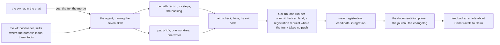

# Cairn 1.2 — what 1.1 taught, for a repository that is not this one

**Promoted from** the owner's
[decisions page](../../feedbacks/2026-09-21-cairn-1-2-decisions.md) at blob
`cfe60ef6804526f939e2d7467fbe1cbee5f8a9df` and the
[asks note](../../feedbacks/2026-09-21-cairn-1-2-the-asks.md) at blob
`837262d5b3a761ef14d14bad0be8278133256e53`, through the fourteen
[decision records](../adr/index.md) ADR-030 to ADR-043, by
[CP-CAIRN-012](../../project/coding-paths/CP-CAIRN-012/index.md). The two
notes and the nine notes, the journal entry and the two brainstorm notes
they gather stay exactly as they were. This page states what the records
decide as one shape, in the sections of [the 1.1 page](./01-cairn-1-1.md);
where a sentence relies on a record, the record is named, and where a
record supersedes one of 1.1, the 1.1 page's sentence keeps its words and
carries a *superseded by* mark.

## What 1.2 is for

Cairn 1.1 was released on 2026-09-16 for the repository its first adopter
is: one owner, agents as writers, GitHub as the host, one workflow. Then
three repositories that are not this one met it — Crumbz updating an
edited 1.0 kit, Atomik adopting a hand-carried 0.2 installation on a
trunk that refuses a direct push, ECOS running its first three paths on
`pull-request` transport with one owner holding every role — and nine
notes under `feedbacks/`, the release path's own findings, path 6's
journal entry and two brainstorm notes asked thirty-six things of the
protocol. The owner answered twenty questions on 2026-09-21 and took
every ask.

1.2 is the protocol for the repository that is not this one. It changes
no stage of the chronology. It changes how a
path registers where the trunk takes no push, what the installer reads
before it writes and says after, where a fact is written once, how a
note about Cairn reaches Cairn, and who reads the candidate before the
owner does.

## The shape in one diagram

As on the 1.1 page, dependencies point one way, left to right (ADR-019,
decision 2; ADR-023, decision 3). The channel at the right is the one
node 1.2 adds, and nothing depends on it.

## How a path opens

Before the go-ahead, the agent reads the plan for two holes the records
may have left: an angle-bracketed name in a surface a record names, and
a definition-of-done item that contradicts the record it cites. Both go
into the record's questions, where the owner answers once, rather than
into a unit's chat where the path stops (ADR-030). The definition of done
is a plain list, not checkboxes, so nothing in the text the scope digest
pins invites the tick the rule forbids; records already accepted keep
their text (ADR-042, superseding ADR-002 decision 2). When a path is
proposed, the open skill reads `project/backlog/` for the deferred item
the path may be taking (ADR-041).

The registration commit is what it was — the record and the view,
nothing else, its parent the trunk tip pinned as `base_commit`. The
direct-push sequence names its precondition: a trunk that accepts a
direct push, unprotected or with a bypass for the writer. A trunk that
requires a request registers through a request carrying the same
commit, on `transport.registration: pull-request`, a value that now has
a sequence behind it; the branch and its worktree are created from the
trunk once the request has merged, and nothing is coded before (ADR-032,
decisions 1 and 2, superseding two clauses of ADR-001 decision 1). The
kit still installs `manual-git` (ADR-024).

## How a path runs

A unit's five movements do not change. The coding stance the writer
takes during *change* still comes from Ponytail, and the two skills it is
built on are now on disk: the kit extracts `ponytail` and
`ponytail-review` from the plugin's latest version at `init` and
`update`, the lock names the version, and the pinned tag goes (ADR-036,
superseding the first half of ADR-016 decision 1). Every skill the kit
installs — its own seven and those two — is written where the adopter's
harness loads skills, Claude Code's `.claude/skills/` first, while
`skills/` stays the folder the bootloader points at (ADR-036, decision
2).

A review finding or a closing advisory that is deferred names a file
under `project/backlog/` — what the item is, which path deferred it, the
owner, the shape of the work — instead of a sentence nobody reads again
(ADR-041). A file under `feedbacks/` is still what the writer writes when
the gate stayed green and the protocol still cost more than it should
(ADR-028).

## How a path closes

The writer produces the candidate, runs the gate on it, and hands the
candidate to a second context of its own agent — given the diff, the
governing documents at their ids, the live view and the four coherence
questions, and nothing else. Its answers go into the request's
description with a first line naming the reader, and the owner
arbitrates what was found rather than hunting for it; `cairn-audit`
scaffolds the records the diff touches, the sibling paths' `writes:` and
the architecture pages changed with no record beside them (ADR-043,
extending ADR-017 decision 1). On `pull-request` transport with one
owner, the administrative commit lands on the branch before the owner is
asked to read and try the result, so an owner who reads and clicks merge
integrates a branch whose `ready` is already there (ADR-040). The close
skill's sentence beside the README question says that a measured figure
the path changed is written once and linked from everywhere else
(ADR-031, decision 1). A `deferred` disposition names its backlog file
(ADR-041). The close skill no longer points at a file no release
installs (ADR-034, decision 8).

The release path has two more steps: it writes the release's section
of `CHANGELOG.md`, naming first the adopter repairs the release absorbed
and the ones it did not, by the adopter's path ids (ADR-039), and it
moves every note the release answered into `feedbacks/<release>/`, whose
index names what answered each (ADR-038, decision 3).

## What the checker reads at each transition

The checker is the same tool, reading one more folder and one more case.

| Transition | What is read | Record |
| :-- | :-- | :-- |
| registration through a request | a declaration absent from the trunk is registered when the run's own comparison contains the commit that declares it `running`, that commit touches the record and the view and nothing else, and its parent is the declared `base_commit`; on a trunk that took the commit directly, the rule answers as before | ADR-032 d3 |
| every run, the corpus | `feedbacks/` joins the roots `links` reads; `schema` has nothing to read there | ADR-038 d1 |
| every run, `links` | a path the configuration declares, with its reason, is not resolved — a portrayal, a frozen history | ADR-037 d1 |
| any run, `comparison` | its two messages say GitHub where GitHub is meant | ADR-034 d6 |

The checker still asks the host nothing and makes no network call
(ADR-029); the one host reading 1.2 adds is the installer's, once, at
the owner's terminal (ADR-032, decision 4). The fixture that went red
once on `record-integrity` is read for the order it depends on (ADR-034,
decision 7).

## What the installer reads and reports

`init`, `update` and `adopt` read the repository's own declarations
before they write, and say what they leave behind.

| Command | Reads | Reports or refuses | Record |
| :-- | :-- | :-- | :-- |
| `init`, `adopt` | the two transports and the profile; the trunk's rules from GitHub, where the owner's token lets it | `protected` beside `manual-git` registration, refused at `adopt` from the declarations alone; `manual-git` registration on a trunk with no bypass for the writer, refused where the reading was obtained, and said unread where it was not | ADR-032 d4 |
| `init`, `update`, `adopt` | every root the configuration declares — architecture, decisions, modules, concepts | a root derived only where none is declared; the plan asserts every path it writes falls under one | ADR-033 d1 |
| `update` | a host file the owner declined, a field of the lock | *declined*, never *missing*; listed on the pointer page | ADR-033 d2 |
| `update` | the generated view, excluded from the reconcile list; the files it starts managing | the third kind beside written and kept, on the pointer page with the kept | ADR-034 d1, d3 |
| `status`, `update` | one plan, built by one function, the migrated configuration in it | `status` names no rewrite `update` will not make | ADR-034 d4 |
| `init`, `update` | the release's stamp date for every generated page | two generations of one release are byte-equal | ADR-034 d2 |
| `init`, `update` | Ponytail's latest release, two skills, downloaded | the version in the lock; *not read* in one line when offline | ADR-036 d1 |
| `adopt` | a kept manifest or workflow that calls a file it made stale; a file whose relative links do not resolve | *your gate is red until they go*, under the stale line; a shape that wants a declaration, not a repair | ADR-033 d4; ADR-037 d2 |
| `status` | a newer release | its changelog section, linked at the release's commit | ADR-039 |

What the kit installs grows by the seventh skill `cairn-update` — an
adopter's update as a path: the reading first, the owner's two decisions
on edited kit files and unwanted host files before the go-ahead, the run,
the reconciliation of only what the report named, what it cost said back
to Cairn (ADR-035) — by `feedbacks/` and `project/backlog/` with their
indexes (ADR-038 decision 2, ADR-041), by Ponytail's two skills and a
second location for every skill (ADR-036), and by a documentation index
written in the shape it describes rather than the state it asserts
(ADR-033, decision 3). The count is measured on the conformance page and
bounds nothing (ADR-022, decision 2).

## What a record and the register may say

A measured figure — the kit's file count, its skill count — is written
once, in the conformance page's budget table, one row per figure, and
linked from the four places that restated it: the kit row of the same
page, the README, the tools' module note, the installer's header comment
(ADR-031, decision 1). The state cells of the roadmap register — the
milestone table's State column, and the state a coding-paths table
writes beside a path — are generated by `cairn-active` from each path's
`status:`, so a path's state is written in one place, and `--check`
reports a stale cell (ADR-031, decision 2). A record's implementation
table may say *pending* against a decision no path has landed, naming
the register row that owes it; the row names the clause back, and the
path that lands the mechanism clears the word (ADR-031, decision 3). The
first *pending* is ADR-015 decision 2's release line, owed by the release
path of 1.2.

## The channel between an adopter and Cairn

`feedbacks/` is a folder of every adopter, and a note about Cairn written
there travels to this repository by a pull request against it or by the
owner carrying it; a note about the adopter's own use stays home
(ADR-038, decision 2). Here, the folder is
read by the `links` rule like the other four roots (ADR-038, decision 1).
A note written from 1.2 on carries `type: Cairn Feedback`, read by no
rule; the notes that carry another type keep it (ADR-038, decision 5). A
treated note moves into `feedbacks/<release>/`, whose index names what
answered it, and its `cairn.status` stays as it is — the folder says
*treated* by being looked at (ADR-038, decision 3, the owner's ruling of
2026-09-21). A note whose claim was withdrawn says so in one line at its
head — the date, what was withdrawn, what replaced it — written by
whoever corrects it (ADR-038, decision 4). And in the other direction,
`CHANGELOG.md` names, by the adopter's path ids, what a release absorbed
from the adopter and what it did not (ADR-039).

## What the documentation plane holds, and where

What 1.2 adds to the 1.1 page's table:

| Where | What | Written by | Record |
| :-- | :-- | :-- | :-- |
| `feedbacks/`, in every adopter | the notes about Cairn before they travel, and the adopter's own; an index the kit installs | the writer, when there is something to say | ADR-038 d2 |
| `feedbacks/<release>/`, here | the notes a release answered, with an index naming what answered each | the release path | ADR-038 d3 |
| `project/backlog/` | one file per deferred item — what, which path, the owner, the shape of the work; deleted by the path that takes it | a `deferred` disposition; the taking path | ADR-041 |
| `CHANGELOG.md`, here | one section per release: the adopter repairs absorbed and not, by their path ids, then what the release changes for an adopter | the release path | ADR-039 |
| `.claude/skills/<name>/`, and the location of every harness the kit knows | the kit's skills where the harness loads them, owned by the lock; `skills/` stays what the bootloader points at | the kit, at `init` and `update` | ADR-036 d2 |
| `cairn.config.json` | the paths whose links the `links` rule does not resolve, a reason beside each | the adopter | ADR-037 d1 |
| `cairn.lock.json` | the declined host files; the Ponytail version installed; the harness files | the kit | ADR-033 d2; ADR-036 |
| `project/coding-paths/index.md` | its state cells, generated | `cairn-active` | ADR-031 d2 |

The 1.1 page stays the page for what it states; where a record here
supersedes a sentence of it, the sentence carries the mark and this page
carries the shape.

## Which tools exist

| Command | Does, since 1.2 | Record |
| :-- | :-- | :-- |
| `cairn-check` | reads `feedbacks/`; reads a registration in the change under review; skips the declared link exemptions; says GitHub in its `comparison` messages | ADR-038 d1; ADR-032 d3; ADR-037 d1; ADR-034 d6 |
| `cairn-active` | fills the register's state cells from the records, and reports a stale one | ADR-031 d2 |
| `cairn-audit` | scaffolds the three facts under the coherence questions; reads a definition-of-done item from a plain list; points a deferral at its backlog file | ADR-043; ADR-042; ADR-041 |
| `cairn-postmortem` | counts the run it runs in; prints a closed request as closed; on the trunk reads the one path that arrived, or the finding first and no path | ADR-034 d9, d10, d11 |
| `cairn` | what the installer table above says, command by command | ADR-032 d4; ADR-033; ADR-034 d1–d4; ADR-036; ADR-037 d2; ADR-039 |
| `cairn-update` | the seventh skill, not a tool: an adopter's update as a path | ADR-035 |
| the workflow | its failure step tells the post-mortem it is the run, and passes the base | ADR-034 d9, d11 |

## What 1.2 removes from 1.1

- **The pinned Ponytail tag the kit copied nothing of** (ADR-036).
- **The checkboxes of the definition of done** (ADR-042).
- **The direct push as the only registration** (ADR-032).
- **The folder no tool reads** (ADR-038).
- **The owner answering the coherence questions** (ADR-043).
- **The administrative commit after the owner's reading**, on
  `pull-request` with one owner (ADR-040).
- **The close skill's link to a file no release installs** (ADR-034,
  decision 8).
- **Four restatements of a measured count, and a State column kept by
  hand** (ADR-031).

And what 1.2 keeps that a note asked to reconsider: the checker asks the
host nothing (ADR-029) — the installer asks, once, and says why it may
(ADR-032, decision 4) — and the merge click as the whole of a sole
owner's closing acceptance (ADR-001, decision 4), which ADR-040 moves the
administrative commit ahead of rather than replacing.

## Who the pedagogy writes for

As the 1.1 page says: the junior who needs a frame and the senior who
wants just enough. Nothing of it changes in 1.2.

## What this page does not say

How any of it is coded. Each record names the rule, skill, file or command
it changes by today's name, and the
[roadmap register](../../project/coding-paths/index.md)'s 1.2 row scopes
the coding paths of 1.2 from those tables.
